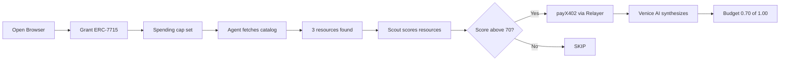
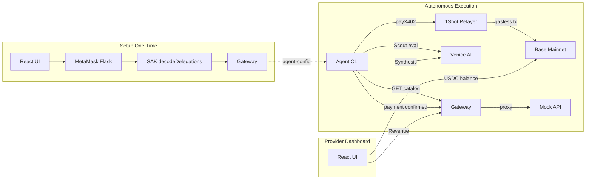
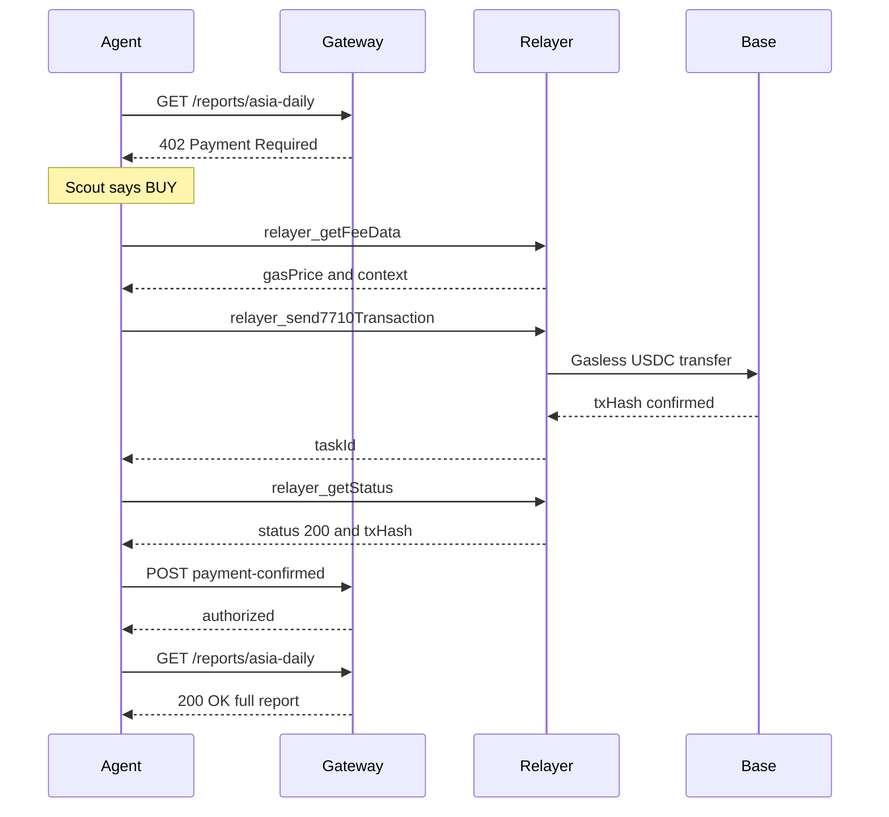

<div align="center">

# PayCrawl

### Autonomous Pay-Per-Crawl with MetaMask Smart Accounts

**An AI agent that crawls paid data sources, reasons about value vs. cost using Venice AI, pays gasless via ERC-7715/ERC-7710, and synthesizes insights — all without human in the loop.**

Built for the **MetaMask Smart Accounts Kit × 1Shot API × Venice AI Dev Cook Off**

[](https://docs.base.org)
[](https://docs.metamask.io/smart-accounts-kit/)
[](https://venice.ai)
[](https://1shotapi.com)
[](https://x402.org)

</div>

---

## The Problem

AI agents need real-time, high-quality data to make decisions. But premium data sits behind paywalls, and agents have no way to pay for it without human intervention.

**Current workflow:**
```
Agent encounters paywall → stops → waits for human
→ human opens wallet → approves $0.10 payment
→ agent resumes
```

This breaks the entire promise of autonomous AI. For the agent economy to work, agents need to:
- **Evaluate** if data is worth the price (not just buy everything)
- **Pay** autonomously without asking for permission every time
- **Stay within budget** with enforced spending caps
- **Operate gaslessly** — a $0.10 data purchase shouldn't cost $2.00 in gas

## The Solution

PayCrawl makes AI agents **autonomous economic actors** that can reason about data value and pay for it without any human in the loop.

**PayCrawl workflow:**
```
Agent hits paywall → Venice AI evaluates "is this worth the price?"
→ YES: agent pays gaslessly via stored permissions (no popup)
→ NO: agent skips and explains why
→ agent synthesizes purchased data into comprehensive analysis
```

**One MetaMask popup. Then the agent is fully autonomous.**

---

## 🏆 Track Coverage

| Track | Prize | What We Built |
|-------|-------|---------------|
| **Best x402 + ERC-7710** | $3,000 | Full x402 protocol (HTTP 402 + accepts[]), ERC-7710 gasless execution via 1Shot relayer, on-chain payment confirmation |
| **Best use of Venice AI** | $3,000 | 4-phase multi-agent pipeline (Scout → Buyer → Analyst → Synthesizer), function-calling tools, budget-aware cost/value reasoning, multi-source synthesis |
| **Best Agent** | $3,000 | Autonomous loop: plan → crawl → reason → pay → synthesize. Budget management, quality-maximizing decisions |
| **Best Use of 1Shot Relayer** | $1,000 USDC | Full JSON-RPC client (getFeeData, send7710, getStatus), gasless execution, fee + work legs |

---

## How It Works

### The Agent's Decision Process



### What Makes This Special

**The agent doesn't just buy everything.** Venice AI (GLM-5) makes nuanced value judgments:

| Resource | Price | Quality | Decision | Cost Analysis |
|---|---|---|---|---|
| Asia Daily | $0.10 | Fresh (4h), 3 verified, 87% confidence | ✅ Buy | $0.033/source — excellent value |
| Quick Take | $0.40 | Stale (9 days), 1 unverified, 23% | ❌ Skip | $0.40/source — overpriced junk |
| Deep Dive | $0.60 | Fresh (today), 5 verified, 94% | ✅ Buy | $0.12/source — essential data |

**Total: $0.70 of $1.00 budget.** The agent chose to pay MORE ($0.60) for the deep-dive because 5 verified sources at $0.12/source is better value than 1 unverified source at $0.40. A simple bot would buy the cheapest or buy everything. Venice AI maximizes **quality per dollar**.

---

## Architecture



### Payment Flow



---

## Prerequisites

| Requirement | Version | Install |
|---|---|---|
| **Go** | 1.25+ | [go.dev/dl](https://go.dev/dl/) |
| **Node.js** | 22+ | [nodejs.org](https://nodejs.org/) |
| **MetaMask Flask** | 13.5.0+ | [Flask extension](https://metamask.io/flask/) (separate browser profile!) |
| **Venice API Key** | — | [venice.ai/settings/api](https://venice.ai/settings/api) |
| **Base USDC** | For payments | Bridge USDC to Base (~$5 is plenty; gas is sponsored by 1Shot) |

---

## Quick Start

### 1. Clone & Install

```bash
git clone https://github.com/dwlpra/PayCrawl.git
cd PayCrawl

# Install dependencies
cd agent && npm install
cd ../ui && npm install
```

### 2. Configure Environment

```bash
cp .env.example agent/.env
```

Edit `agent/.env`:
```env
# Required
VENICE_API_KEY=your_venice_api_key_here
VENICE_MODEL=zai-org-glm-5

# Optional (defaults work for local dev)
GATEWAY_URL=http://localhost:19090
CHAIN_ID=8453                   # 8453 = Base mainnet (default)
RPC_URL=https://mainnet.base.org
```

Gateway config via environment:
```bash
export GATEWAY_WALLET=0xYourProviderWallet     # receives payments
export GATEWAY_SECRET=your-secret               # shared with proxy
export MOCK_API_URL=http://localhost:18091
```

### 3. Start Services

```bash
# Terminal 1 — Data provider (mock API)
cd mock-api && go run .
# → mock-api listening on :18091

# Terminal 2 — x402 Gateway
cd gateway && go run .
# → gateway listening on :19090

# Terminal 3 — React UI
cd ui && npm run dev
# → vite listening on :5173
```

Or use PM2 for process management:
```bash
pm2 start gateway/gateway --name paycrawl-gw --cwd .
pm2 start "npx vite" --name paycrawl-ui --cwd ui
```

### 4. Setup MetaMask (browser)

1. Open **http://localhost:5173** in a browser with MetaMask Flask installed
2. Switch MetaMask to **Base** network
3. Click the wallet button (top right) → **Connect MetaMask**
4. Go to **Agent** page → set budget → click **Grant Permissions (ERC-7715)**
5. Approve — MetaMask popup shows spending cap
6. The UI decodes the delegation via `@metamask/smart-accounts-kit/utils` (`decodeDelegations`) and stores structured JSON in the gateway

### 5. Run Agent

```bash
cd agent && npx tsx src/index.ts "Summarize this week's Asian crypto market sentiment"
```

Or start a crawl from the **Agent** page in the UI.

### 6. View Provider Dashboard

Open **http://localhost:5173/provider** to see on-chain balance, revenue, purchase history (with BaseScan links), and resource management.

---

## Tech Stack

| Component | Tech | Role |
|---|---|---|
| **Gateway** | Go 1.25 | x402 middleware, payment authorization, purchase logging (JSONL), provider API |
| **Mock API** | Go | Paid content endpoints with rich market data (3 reports) |
| **Agent** | TypeScript + Venice AI (GLM-5) | 4-phase pipeline: Scout → Buyer → Analyst → Synthesis |
| **React UI** | React + wagmi + viem | MetaMask connection, ERC-7715 grant, provider dashboard, crawl terminal + report viewer |
| **Smart Accounts** | MetaMask SAK v1.6.0 | ERC-7715 permissions (`erc20-token-periodic`), decoded delegations via `decodeDelegations` |
| **Relayer** | 1Shot Permissionless API | Gasless ERC-7710 execution: `getFeeData`, `send7710Transaction`, `getStatus` |
| **Chain** | Base Mainnet | USDC (`0x833589fCD6eDb6E08f4c7C32D4f71b54bdA02913`), 6-decimal precision |

---

## Project Structure

```
├── gateway/                  # Go — x402 gateway + REST API
│   ├── main.go               # Entry point, CORS, routes, /api/payment-confirmed,
│   │                         #   /api/purchases (JSONL-based purchase log)
│   ├── config.go             # Environment-driven config
│   ├── catalog.go            # GET /catalog proxy to mock-api
│   ├── dashboard.go          # Provider dashboard data
│   ├── resources.go          # REST API: resources, agent-config, crawl
│   ├── middleware/x402.go    # 402 + accepts[] paywall protocol
│   ├── payments/store.go     # Authorization store with TTL
│   └── proxy/proxy.go        # Reverse proxy to mock-api
├── mock-api/                 # Go — paid content data provider (3 reports)
├── agent/                    # TypeScript — AI agent
│   ├── src/index.ts          # Entry point, config validation, startup banner
│   ├── src/brain.ts          # 4-phase pipeline: Scout (AI) → Buyer (deterministic)
│   │                         #   → Analyst (AI) → Synthesis (AI)
│   ├── src/config.ts         # Centralized config (Base mainnet default)
│   ├── src/utils/format.ts   # Terminal formatting + BaseScan tx links
│   ├── src/tools/
│   │   ├── fetchResource.ts  # HTTP client, 402 detection, authorized fetch
│   │   └── payX402.ts        # Live on-chain payment via 1Shot relayer
│   └── src/wallet/
│       ├── erc20.ts          # ERC-20 transfer calldata encoder
│       └── relayer.ts        # 1Shot JSON-RPC client (correct param formats)
├── ui/                       # React + wagmi — control panel & dashboards
│   └── src/
│       ├── pages/AgentBridge.tsx       # MetaMask connect + ERC-7715 grant
│       │                               #   (raw window.ethereum.request + SAK decode)
│       ├── pages/ProviderDashboard.tsx # Revenue, purchases, resource management
│       ├── components/
│       │   ├── CrawlResultCard.tsx     # Console terminal + markdown report + PDF
│       │   ├── Navbar.tsx              # BASE MAINNET badge + role badges
│       │   ├── PurchaseTable.tsx       # Purchase history with BaseScan links
│       │   └── RolePickerModal.tsx     # Provider/Agent role selection
│       ├── hooks/
│       │   ├── useGatewayApi.ts        # Gateway state (resources, purchases, config)
│       │   ├── useRole.ts              # Role-based access (Provider/Agent)
│       │   └── useUsdcBalance.ts       # On-chain USDC balance (wagmi)
│       └── config/wagmi.ts             # Wagmi config (Base + Base Sepolia)
└── payments.jsonl            # Purchase log (auto-created, file-based)
```

---

## x402 Protocol Implementation

The gateway implements the [x402](https://x402.org) HTTP-native pay-per-request protocol:

**402 Response (paywall):**
```json
{
  "x402Version": 1,
  "error": "X-PAYMENT header is required",
  "accepts": [{
    "scheme": "exact",
    "network": "base",
    "maxAmountRequired": "600000",
    "resource": "/reports/deep-dive",
    "description": "Asia Crypto Sentiment — Deep Dive Analysis",
    "payTo": "0xProvider_wallet",
    "asset": "0x833589fCD6eDb6E08f4c7C32D4f71b54bdA02913",
    "maxTimeoutSeconds": 60
  }]
}
```

**Authorization:** After payment, the agent calls `POST /api/payment-confirmed` with the wallet address, resource path, amount, and txHash. The gateway authorizes the wallet for 5 minutes via `X-AUTHORIZED-WALLET` header.

---

## Key Implementation Details

### Why raw `window.ethereum.request` instead of viem/SAK middleware?

Viem's `createWalletClient` wraps requests with `buildRequest`/`withDedupe`/`withRetry` middleware that can strip fields like `to` and `isAdjustmentAllowed`. The proven approach uses raw `window.ethereum.request({ method: 'wallet_requestExecutionPermissions', params })` and then decodes the result separately via `decodeDelegations` from `@metamask/smart-accounts-kit/utils`.

### Why deterministic buyer instead of AI tool-chaining?

LLM tool-chaining (fetchResource → payInvoice → fetchResource) is unreliable — models often stop after the first 402. The Scout phase (Venice AI) evaluates all resources, then the Buyer phase executes purchases deterministically based on scores. This gives **reliable payment execution** while keeping AI reasoning for evaluation and synthesis.

### Relayer RPC formats

The 1Shot relayer uses specific JSON-RPC param formats:
- `relayer_getCapabilities`: `params = ["8453"]`
- `relayer_getFeeData`: `params = { chainId: "8453", token: "0x..." }`
- `relayer_send7710Transaction`: `params = { chainId, context, transactions: [{ permissionContext, executions: [{ target, value, data }] }] }`
- `relayer_getStatus`: `params = { id: taskId }`

### Venice AI Model

Uses `zai-org-glm-5` (GLM-5 via Venice API). Excellent at structured evaluation (scout scoring with function-calling tools) and report synthesis. The 4-phase pipeline separates reasoning (AI) from execution (code) for reliability.

---

## Chain Configuration

The project runs on **Base mainnet by default** (`CHAIN_ID=8453`, real USDC). Testnet (Base Sepolia, `84532`) is supported — set `CHAIN_ID=84532` in `agent/.env`.

| Config | Base Mainnet (default) | Base Sepolia |
|--------|----------------------|--------------|
| chainId | 8453 | 84532 |
| USDC | `0x833589fCD6eDb6E08f4c7C32D4f71b54bdA02913` | `0x036CbD53842c5426634e7929541eC2318f3dCF7e` |
| RPC | `https://mainnet.base.org` | `https://sepolia.base.org` |
| Relayer | `https://relayer.1shotapi.com/relayers` | `https://relayer.1shotapi.dev/relayers` |

> **Note on gas:** 1Shot's Permissionless Relayer sponsors gas, so the agent wallet does **not** need ETH — only USDC for the data purchases.

---

## Key Code Links

Judges can review the core implementation directly:

**MetaMask Smart Accounts Kit / ERC-7715:**
- [Request Advanced Permissions (UI)](https://github.com/dwlpra/PayCrawl/blob/main/ui/src/pages/AgentBridge.tsx) — raw `window.ethereum.request` with `wallet_requestExecutionPermissions`
- [Decode Delegations via SAK](https://github.com/dwlpra/PayCrawl/blob/main/ui/src/pages/AgentBridge.tsx) — `decodeDelegations` from `@metamask/smart-accounts-kit/utils`

**1Shot Permissionless Relayer / ERC-7710:**
- [Relayer RPC Client](https://github.com/dwlpra/PayCrawl/blob/main/agent/src/wallet/relayer.ts) — getFeeData, send7710Transaction, getStatus
- [Payment Execution (payX402)](https://github.com/dwlpra/PayCrawl/blob/main/agent/src/tools/payX402.ts) — encode ERC-20 transfer + submit to relayer

**Venice AI:**
- [4-Phase Pipeline (brain.ts)](https://github.com/dwlpra/PayCrawl/blob/main/agent/src/brain.ts) — Scout, Buyer, Analyst, Synthesis
- [Agent Config & Venice Setup](https://github.com/dwlpra/PayCrawl/blob/main/agent/src/config.ts) — Venice API + model configuration

**x402 Protocol:**
- [Gateway x402 Middleware](https://github.com/dwlpra/PayCrawl/blob/main/gateway/middleware/x402.go) — HTTP 402 + accepts[] schema
- [Payment Confirmation Endpoint](https://github.com/dwlpra/PayCrawl/blob/main/gateway/main.go) — POST /api/payment-confirmed + purchase log

---

## Qualification Checklist

- ✅ Uses **MetaMask Smart Accounts Kit** (`@metamask/smart-accounts-kit` v1.6.0)
- ✅ Implements **ERC-7715 Advanced Permissions** (`wallet_requestExecutionPermissions`, `erc20-token-periodic`)
- ✅ Uses SAK `decodeDelegations` to decode permission context for the relayer
- ✅ MetaMask Smart Accounts in the **main flow** (permission grant → autonomous payment → data retrieval)
- ✅ **Venice AI** as core reasoning engine (GLM-5, function calling, cost/value analysis, synthesis)
- ✅ **1Shot Permissionless Relayer** for gasless ERC-7710 execution (JSON-RPC)
- ✅ **x402 protocol** for HTTP-native pay-per-request (402 + accepts[])
- ✅ **No smart contract deployment** — fully protocol-level via EIP-7702 + ERC-7715 + x402
- ✅ **Real on-chain transactions** on Base mainnet (verified on BaseScan)

---

## Feedback

Building PayCrawl over this hackathon surfaced several real developer experience challenges with the ERC-7715/7710 ecosystem. Sharing these constructively to help improve the stack:

**MetaMask Flask + SAK Integration:** The biggest challenge was viem's wallet client middleware stripping critical fields (`to`, `isAdjustmentAllowed`) from `wallet_requestExecutionPermissions` calls. We had to bypass viem entirely and use raw `window.ethereum.request()`. Better documentation on which viem versions are compatible with SAK — or a built-in SAK wallet client — would save days of debugging.

**1Shot Relayer RPC Formats:** The JSON-RPC parameter schemas were not clearly documented for ERC-7710 transactions. Figuring out the correct nested `transactions[{permissionContext, executions}]` structure required extensive trial and error. A typed SDK or OpenAPI spec would significantly improve developer experience.

**ERC-7715 Permission Decoding:** `decodeDelegations` from SAK only works in browser context. Agents running in Node.js cannot use SAK directly. A server-side decoding utility would enable cleaner agent-side flows without browser dependencies.

**LLM Reliability for Tool-Chaining:** Venice AI models (and others tested) consistently stopped after encountering HTTP 402 responses, never reaching the payment tool. We pivoted to a deterministic buyer phase based on AI scout scores, which proved far more reliable. Hybrid AI + code pipelines may be the practical sweet spot for production payment agents.

---

## License

MIT
