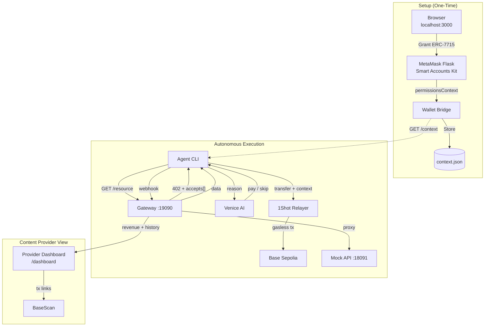
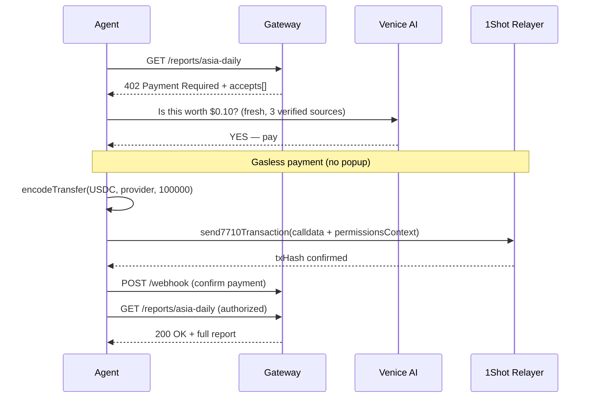
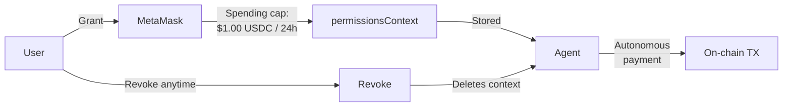

<div align="center">

# PayCrawl

### Autonomous Pay-Per-Crawl with MetaMask Smart Accounts

**An AI agent that crawls paid data sources, reasons about value vs. cost using Venice AI, pays gasless via ERC-7715/ERC-7710, and synthesizes insights — all without human in the loop.**

Built for the **MetaMask Smart Accounts Kit × 1Shot API × Venice AI Dev Cook Off**

[](https://docs.base.org)
[](https://docs.metamask.io/smart-accounts-kit/)
[](https://venice.ai)
[](https://1shotapi.com)
[](https://x402.org)
[]()

</div>

---

## The Problem

AI agents need real-time, high-quality data to make decisions. But premium data sits behind paywalls, and agents have no way to pay for it without human intervention.

**Current workflow:**
```
Agent encounters paywall → stops → waits for human
→ human opens wallet → approves $0.10 payment
→ agent resumes
```

This breaks the entire promise of autonomous AI. For the agent economy to work, agents need to:
- **Evaluate** if data is worth the price (not just buy everything)
- **Pay** autonomously without asking for permission every time
- **Stay within budget** with enforced spending caps
- **Operate gaslessly** — a $0.10 data purchase shouldn't cost $2.00 in gas

## The Solution

PayCrawl makes AI agents **autonomous economic actors** that can reason about data value and pay for it without any human in the loop.

**PayCrawl workflow:**
```
Agent hits paywall → Venice AI evaluates "is this worth the price?"
→ YES: agent pays gaslessly via stored permissions (no popup)
→ NO: agent skips and explains why
→ agent synthesizes purchased data into comprehensive analysis
```

**One MetaMask popup. Then the agent is fully autonomous.**

---

## 🏆 Track Coverage

| Track | Prize | What We Built |
|-------|-------|---------------|
| **Best x402 + ERC-7710** | $3,000 | Full x402 protocol (HTTP 402 + accepts[]), ERC-7710 gasless execution via 1Shot relayer, webhook confirmation |
| **Best use of Venice AI** | $3,000 | Function calling with 3 tools, budget-aware cost/value reasoning ("$0.12/source — good value"), multi-source synthesis |
| **Best Agent** | $3,000 | Autonomous loop: plan → crawl → reason → pay → synthesize. Budget management, quality-maximizing decisions |
| **Best Use of 1Shot Relayer** | $1,000 USDC | Full JSON-RPC client (getFeeData, send7710, pollStatus), gasless execution, webhook integration |

---

## How It Works

### The Agent's Decision Process

```
┌─────────────────────────────────────────────────────────────────┐
│  1. SETUP (one-time, 30 seconds)                                │
│  Open browser → Connect MetaMask Flask → Grant Permissions     │
│  → Spending cap: $1.00 USDC / 24h → permissionsContext stored  │
├─────────────────────────────────────────────────────────────────┤
│  2. CRAWL                                                       │
│  Agent fetches /catalog → sees 3 resources with prices         │
│  → GET /reports/asia-daily → 402 Payment Required              │
│  → GET /reports/deep-dive  → 402 Payment Required              │
├─────────────────────────────────────────────────────────────────┤
│  3. REASON (Venice AI)                                          │
│  "asia-daily: $0.10, fresh 4h, 3 verified src → BUY"          │
│  "quick-take: $0.40, stale 9d, 1 unverified → SKIP"           │
│  "deep-dive:  $0.60, fresh today, 5 verified → BUY"           │
├─────────────────────────────────────────────────────────────────┤
│  4. PAY (gasless, no popup)                                     │
│  encodeTransfer(USDC, provider, 100000)                         │
│  → send7710Transaction(calldata + permissionsContext)           │
│  → 1Shot relayer sponsors gas → txHash confirmed                │
├─────────────────────────────────────────────────────────────────┤
│  5. SYNTHESIZE                                                  │
│  Venice AI combines 2 purchased reports into analysis           │
│  → Budget: $0.70 / $1.00 (30% remaining)                       │
└─────────────────────────────────────────────────────────────────┘
```

### What Makes This Special

**The agent doesn't just buy everything.** Venice AI makes nuanced value judgments:

| Resource | Price | Quality | Decision | Cost Analysis |
|---|---|---|---|---|
| Asia Daily | $0.10 | Fresh (4h), 3 verified, 87% confidence | ✅ Buy | $0.033/source — excellent value |
| Quick Take | $0.40 | Stale (9 days), 1 unverified, 23% | ❌ Skip | $0.40/source — overpriced junk |
| Deep Dive | $0.60 | Fresh (today), 5 verified, 94% | ✅ Buy | $0.12/source — essential data |

**Total: $0.70 of $1.00 budget.** The agent chose to pay MORE ($0.60) for the deep-dive because 5 verified sources at $0.12/source is better value than 1 unverified source at $0.40. A simple bot would buy the cheapest or buy everything. Venice AI maximizes **quality per dollar**.

---

## Architecture



### Payment Flow



### Permission Model



---

## Prerequisites

| Requirement | Version | Install |
|---|---|---|
| **Go** | 1.25+ | [go.dev/dl](https://go.dev/dl/) |
| **Node.js** | 18+ | [nodejs.org](https://nodejs.org/) |
| **MetaMask Flask** | 13.5.0+ | [Flask extension](https://metamask.io/flask/) (separate browser profile!) |
| **Venice API Key** | — | [venice.ai/settings/api](https://venice.ai/settings/api) |
| **Base Sepolia ETH** | For gas | [Coinbase Faucet](https://portal.cdp.coinbase.com/products/faucet) |
| **Base Sepolia USDC** | For payments | [Circle Faucet](https://faucet.circle.com) |

---

## Quick Start

### 1. Clone & Install

```bash
git clone https://github.com/dwlpra/AgentToll.git
cd AgentToll

# Install agent dependencies
cd agent && npm install
```

### 2. Configure Environment

```bash
cp .env.example agent/.env
```

Edit `agent/.env` with your values:
```env
# Required
VENICE_API_KEY=your_venice_api_key_here
AGENT_WALLET=0xYourMetaMaskAddress

# Optional (defaults work for local dev)
GATEWAY_URL=http://localhost:19090
PAYMENT_MODE=live          # live | bridge | stub
RPC_URL=https://sepolia.base.org
EXPLORER_URL=https://sepolia.basescan.org
```

Gateway config via environment:
```bash
export GATEWAY_WALLET=0xYourProviderWallet     # receives payments
export GATEWAY_SECRET=your-secret               # shared with proxy
export MOCK_API_URL=http://localhost:18091
```

### 3. Start Services (3 terminals)

```bash
# Terminal 1 — Data provider
cd mock-api && go run .
# → mock-api listening on :18091

# Terminal 2 — x402 Gateway
cd gateway && go run .
# → gateway listening on :19090

# Terminal 3 — Wallet Bridge
cd agent && npx tsx src/wallet/wallet-bridge.ts
# → wallet bridge listening on :3000
```

### 4. Setup MetaMask (browser)

1. Open **http://localhost:3000** in a browser with MetaMask Flask installed
2. Switch MetaMask to **Base Sepolia** network
3. Click **Connect MetaMask Flask**
4. Click **Grant Permissions (ERC-7715)** — MetaMask popup shows spending cap
5. Approve — permissionsContext stored for autonomous use

### 5. Run Agent

```bash
# With Venice AI (live reasoning):
cd agent && npx tsx src/index.ts "Summarize this week's Asian crypto market sentiment"

# Without API key (mock brain — simulated decisions):
cd agent && npx tsx src/index.ts
```

### 6. View Dashboard

Open **http://localhost:19090/dashboard** to see revenue, purchases, and transaction history.

---

## Tech Stack

| Component | Tech | Role |
|---|---|---|
| **Gateway** | Go | x402 middleware, payment authorization, webhook, provider dashboard |
| **Mock API** | Go | Paid content endpoints with rich market data (3 reports) |
| **Agent** | TypeScript + Venice AI | Reasoning engine with function calling, budget management, synthesis |
| **Wallet Bridge** | TypeScript + WebSocket | MetaMask connection, permission context storage |
| **Smart Accounts** | MetaMask Kit v1.6.0 | ERC-7715 permissions (erc20-token-periodic), ERC-7710 delegation |
| **Relayer** | 1Shot Permissionless API | Gasless execution via JSON-RPC, webhook confirmation |
| **Chain** | Base Sepolia / Base | USDC (Circle) payments, 6-decimal precision |

---

## Project Structure

```
├── gateway/                  # Go — x402 gateway + provider dashboard
│   ├── main.go               # Entry point, CORS, routes, cleanup ticker
│   ├── config.go             # Environment-driven config
│   ├── catalog.go            # GET /catalog proxy with price metadata
│   ├── dashboard.go          # Provider dashboard with revenue chart (canvas)
│   ├── middleware/x402.go    # 402 + accepts[] paywall protocol
│   ├── payments/store.go     # Authorization store with TTL, purchase recording
│   ├── payments/webhook.go   # Payment confirmation handler (amount validation)
│   └── proxy/proxy.go        # Reverse proxy with gateway secret header
├── mock-api/                 # Go — paid content data provider
│   └── main.go               # 3 crypto reports: asia-daily, quick-take, deep-dive
│                             #   Each with: keyMetrics, analysis sections,
│                             #   riskFactors, verdict, confidence score
├── agent/                    # TypeScript — AI agent
│   ├── src/index.ts          # Entry point with config validation & startup banner
│   ├── src/brain.ts          # Venice AI function calling loop (3 tools, 15 iterations)
│   ├── src/mock-brain.ts     # Simulated decisions for testing without API key
│   ├── src/config.ts         # Centralized config with validateConfig()
│   ├── src/utils/format.ts   # Terminal formatting: colors, budget meter, reasoning boxes
│   ├── src/tools/
│   │   ├── fetchResource.ts  # HTTP client with 15s timeout, 402 detection
│   │   └── payX402.ts        # 3 payment modes: live (1Shot) / bridge (browser) / stub (webhook)
│   └── src/wallet/
│       ├── erc20.ts          # ERC-20 transfer calldata encoder (viem)
│       ├── relayer.ts        # 1Shot JSON-RPC client (getFeeData, send7710, pollStatus)
│       ├── permissions.ts    # ERC-7715 grantPermissions via MetaMask Smart Accounts Kit
│       ├── wallet-bridge.ts  # WebSocket bridge server (CLI ↔ browser)
│       ├── wallet-bridge-app.ts  # Browser MetaMask integration (erc7715ProviderActions)
│       └── wallet-bridge.html    # Browser UI with 3-step flow indicator
└── description.md            # HackQuest submission description
```

---

## x402 Protocol Implementation

The gateway implements the [x402](https://x402.org) HTTP-native pay-per-request protocol:

**402 Response (paywall):**
```json
{
  "x402Version": 1,
  "error": "X-PAYMENT header is required",
  "accepts": [{
    "scheme": "exact",
    "network": "base-sepolia",
    "maxAmountRequired": "600000",
    "resource": "/reports/deep-dive",
    "description": "Asia Crypto Sentiment — Deep Dive Analysis",
    "payTo": "0xGATEWAY_WALLET",
    "asset": "0x036CbD53842c5426634e7929541eC2318f3dCF7e",
    "maxTimeoutSeconds": 60
  }]
}
```

**Authorization:** After payment confirmation via webhook, the gateway checks `X-AUTHORIZED-WALLET` header and grants 5-minute access to the purchased resource.

---

## Switching to Mainnet

For the 1Shot bounty track (requires mainnet):

1. Bridge USDC to Base mainnet (~$5 USDC needed)
2. Update `agent/.env`:
   ```env
   PAYMENT_MODE=live
   EXPLORER_URL=https://basescan.org
   RELAYER_URL=https://relayer.1shotapi.com/relayers
   ```
3. Update `agent/src/config.ts`:
   ```typescript
   chainId: 8453           // was 84532
   chainIdHex: "0x2105"    // was "0x14a34"
   usdcAddress: "0x833589fCD6eDb6E08f4c7C32D4f71b54bdA02913"
   ```
4. Switch MetaMask to **Base** (not Sepolia)
5. Grant Permissions again (one popup on mainnet)
6. Run agent → real on-chain USDC transfers with gasless execution

---

## Qualification Checklist

- ✅ Uses **MetaMask Smart Accounts Kit** (`@metamask/smart-accounts-kit` v1.6.0)
- ✅ Implements **ERC-7715 Advanced Permissions** (`erc7715ProviderActions`, `erc20-token-periodic`)
- ✅ MetaMask Smart Accounts in the **main flow** (permission grant → autonomous payment → data retrieval)
- ✅ **Venice AI** as core reasoning engine (function calling, cost/value analysis, synthesis)
- ✅ **1Shot Permissionless Relayer** for gasless ERC-7710 execution (JSON-RPC)
- ✅ **x402 protocol** for HTTP-native pay-per-request (402 + accepts[])
- ✅ **No smart contract deployment** — fully protocol-level via EIP-7702 + ERC-7715 + x402
- ✅ **15/15 tests passing** — full integration test coverage

---

## License

MIT
