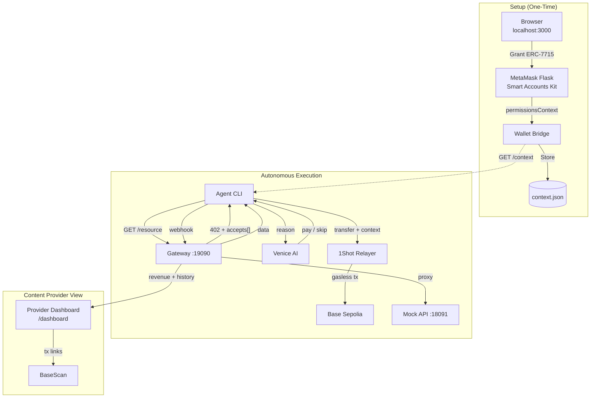
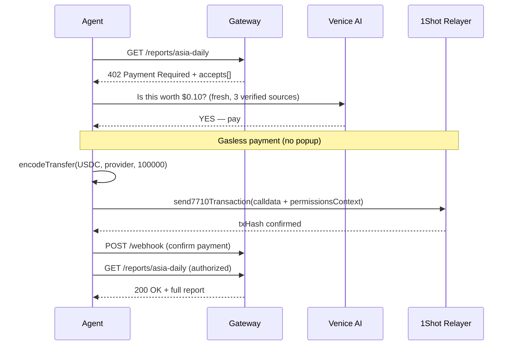
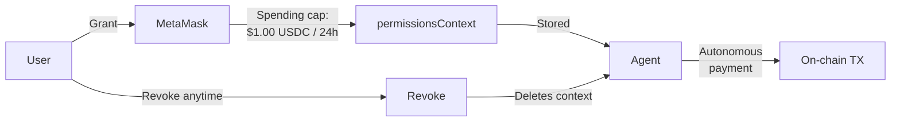

<div align="center">

# AgentToll

### Autonomous Pay-Per-Crawl with MetaMask Smart Accounts

An AI agent that crawls paid data sources, reasons about value vs. cost, pays gasless via ERC-7715/ERC-7710, and synthesizes insights — all without human in the loop.

</div>

---

## How It Works

1. **Setup (once):** User grants ERC-7715 permissions to the agent via MetaMask popup — sets a spending cap ($1.00 USDC/24h)
2. **Crawl:** Agent fetches catalog, encounters x402 paywalls (HTTP 402) on premium content
3. **Reason:** Venice AI evaluates each resource — is it fresh? verified? worth the price?
4. **Pay:** Agent executes gasless USDC transfer via 1Shot relayer using stored permissions — no MetaMask popup needed
5. **Synthesize:** Agent combines purchased data into a comprehensive answer

## Architecture



## Payment Flow



## Permission Model



## Demo Scenario

| Resource | Price | Quality | Decision | Reasoning |
|---|---|---|---|---|
| Asia Daily | $0.10 | Fresh (4h), 3 verified sources | ✅ Pay | Excellent value — cheap, fresh, multi-source |
| Quick Take | $0.40 | Stale (9 days), 1 unverified | ❌ Skip | Overpriced for stale, unverified data |
| Deep Dive | $0.60 | Fresh (today), 5 verified sources | ✅ Pay | Essential for in-depth analysis |

**Result:** $0.70 / $1.00 budget — agent maximizes data quality, not cheapest price.

## Quick Start

```bash
# 1. Start services (3 terminals)
cd mock-api && go run .          # Data provider on :18091
cd gateway && go run .           # x402 gateway on :19090
cd agent && npx tsx src/wallet/wallet-bridge.ts  # Wallet bridge on :3000

# 2. Setup MetaMask (browser)
#    Open http://localhost:3000 → Connect → Grant Permissions

# 3. Run agent
cd agent && npx tsx src/index.ts
```

## Tech Stack

| Component | Tech | Role |
|---|---|---|
| Gateway | Go | x402 middleware, webhook, provider dashboard |
| Mock API | Go | Paid content endpoints |
| Agent | TypeScript + Venice AI | Reasoning, budget management, synthesis |
| Wallet Bridge | TypeScript + WebSocket | MetaMask connection, context storage |
| Smart Accounts | MetaMask Kit v1.6.0 | ERC-7715 permissions, ERC-7710 delegation |
| Relayer | 1Shot API | Gasless execution via JSON-RPC |
| Chain | Base Sepolia / Base | USDC payments |

## Project Structure

```
├── gateway/                  # Go — x402 gateway + provider dashboard
│   ├── main.go
│   ├── dashboard.go
│   ├── middleware/x402.go
│   ├── payments/store.go
│   └── payments/webhook.go
├── mock-api/                 # Go — paid content data
│   └── main.go
├── agent/                    # TypeScript — AI agent
│   ├── src/brain.ts          # Venice AI agent loop
│   ├── src/tools/payX402.ts  # 3 payment modes: live/bridge/stub
│   ├── src/wallet/erc20.ts   # ERC-20 transfer encoder
│   ├── src/wallet/relayer.ts # 1Shot JSON-RPC client
│   ├── src/wallet/wallet-bridge.ts    # Bridge server
│   ├── src/wallet/wallet-bridge-app.ts # Browser app
│   └── src/wallet/wallet-bridge.html  # Browser UI
└── README.md
```

## License

MIT
